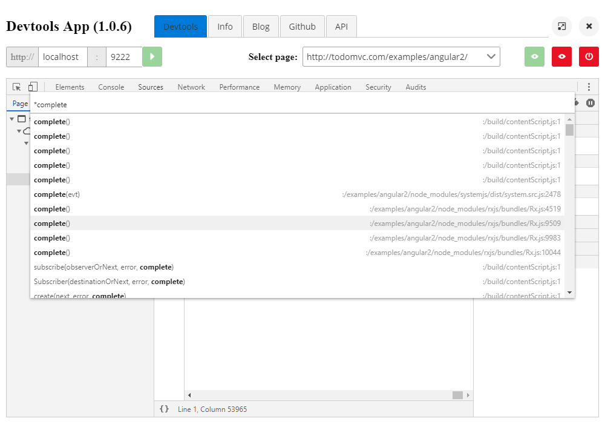

# Devtools App (Angular)

A wrapper for Chrome Devtools.

## How to use?

- Launch Chrome with the following flag

```
> chrome --remote-debugging-port=9222 --remote-debugging-port=9222 --no-first-run --no-default-browser-check
```

- Launch the Devtools App
- Click on green ```play``` button. This will populate the candidate pages to debug.
- Select a page to debug and you will see a hosted Devtools debugging the page you selected.

## Screenshot

